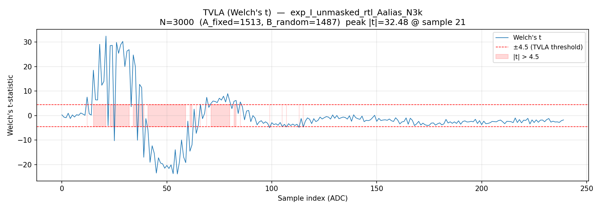
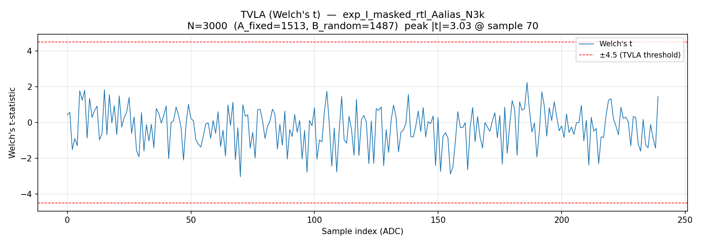
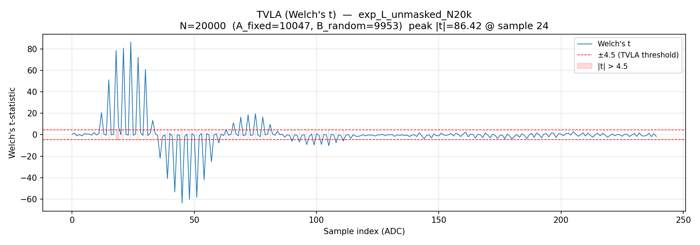
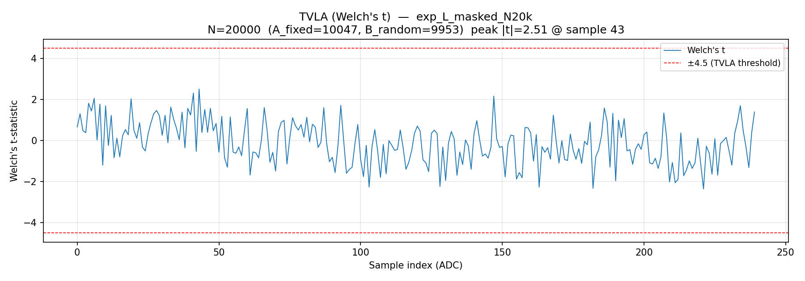
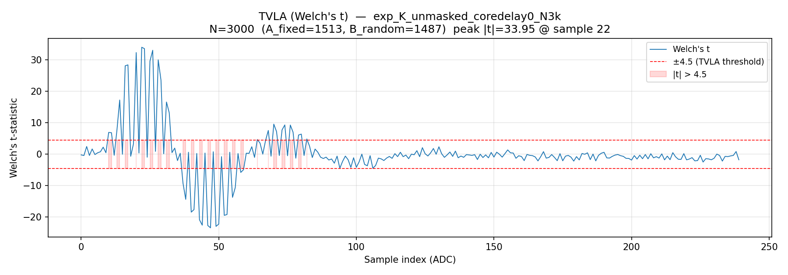
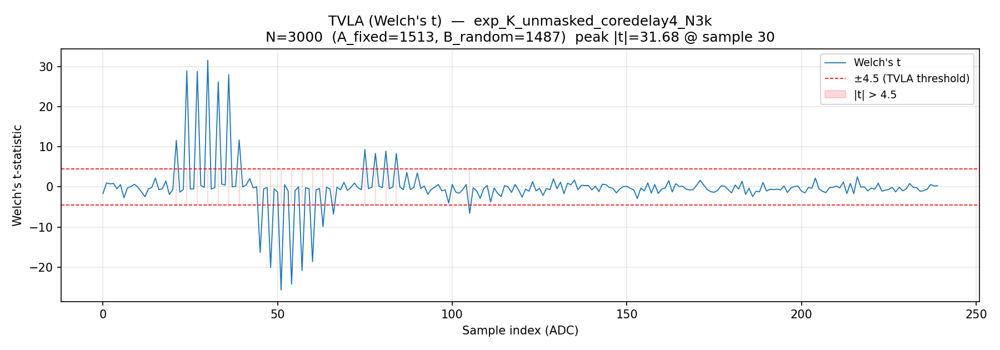
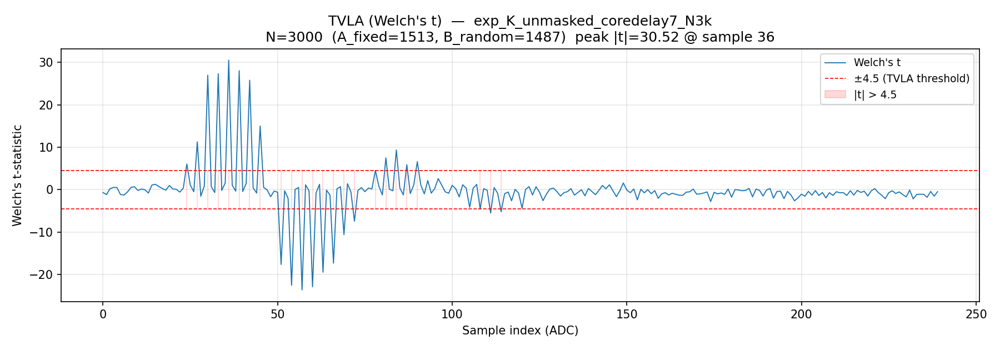

# Unified Butterfly2 Leakage And Masking Report

이 문서는 이 프로젝트의 부채널 실험을 하나로 통합한 최종 설명서다.
초심자가 이 파일과 [experiments/README.md](experiments/README.md)만 읽어도 다음을
이해할 수 있도록 작성했다.

- 이 실험의 목표가 무엇이었는지
- CW305 wrapper와 register가 어떻게 동작하는지
- 어떤 flow로 누설 위치를 좁혔는지
- 어떤 산출물 폴더와 TVLA plot을 봐야 하는지
- masking을 왜, 어떻게 RTL에 정합하게 구현했는지
- 현재 결론과 아직 남은 검증 항목이 무엇인지

## 1. 최종 결론

한 문장으로 정리하면:

> normal capture의 큰 peak에는 `REG_B` write/input path 영향이 섞여 있었지만,
> 그 영향을 제거해도 butterfly core 계산 경로에서 값 의존 1차 누설이 실제로 남는다.
> `a,b`를 additive share로 나누고 RTL에서 share-wise로 계산하면 현재 N=20000 1차
> TVLA 기준에서는 누설 peak가 threshold 아래로 내려간다.

현재 최종 bitstream은 항상 two-share datapath를 포함한다. 따라서 이 문서의 최신
`unmasked` 비교는 별도 single-core bitstream이 아니라, 같은 bitstream에
`share0=logical value`, `share1=0`을 넣는 zero-share control이다. 즉 "마스킹 회로를
물리적으로 제거한 하드웨어"와의 비교가 아니라, 같은 하드웨어에서 입력 encoding만
unshared/shared로 바꾼 비교다.

대표 결과:

| 단계 | 대표 산출물 | peak | 판정 |
|---|---|---:|---|
| 초기 Kyber CT baseline | [`20260510_200546_exp_A2_kyber_ct_a_mod_N20k`](../host/results/20260510_200546_exp_A2_kyber_ct_a_mod_N20k) | `|t|=90.321 @ s21` | leakage |
| F11 normal positive | [`20260511_175513_exp_F11_positive_control_normal_N3k`](../host/results/20260511_175513_exp_F11_positive_control_normal_N3k) | `|t|=34.841 @ s21` | leakage |
| F11 B scrub | [`20260511_175422_exp_F11_random_b_then_fixed_b_scrub_repro_N3k`](../host/results/20260511_175422_exp_F11_random_b_then_fixed_b_scrub_repro_N3k) | `|t|=2.957` | no leakage |
| Core-only preload | [`20260511_194055_exp_F12b_preload_core_tdelay0_gain0_N3k`](../host/results/20260511_194055_exp_F12b_preload_core_tdelay0_gain0_N3k) | `|t|=29.788 @ s23` | leakage |
| Core force-zero control | [`20260511_194134_exp_F12b_preload_force_core_zero_gain0_N3k`](../host/results/20260511_194134_exp_F12b_preload_force_core_zero_gain0_N3k) | `|t|=3.407` | no leakage |
| Final unmasked RTL | [`20260511_210817_exp_I_unmasked_rtl_Aalias_N3k`](../host/results/20260511_210817_exp_I_unmasked_rtl_Aalias_N3k) | `|t|=32.477 @ s21` | leakage |
| Final masked RTL | [`20260511_210842_exp_I_masked_rtl_Aalias_N3k`](../host/results/20260511_210842_exp_I_masked_rtl_Aalias_N3k) | `|t|=3.035` | no first-order leakage |
| Final masked RTL, older delay check | [`20260511_210917_exp_I_masked_rtl_Aalias_tdelay2_N3k`](../host/results/20260511_210917_exp_I_masked_rtl_Aalias_tdelay2_N3k) | `|t|=2.487` | no first-order leakage |
| Core-start delay 0/4/7 | [`exp_K_*`](experiments/README.md) | `s22 -> s30 -> s36` | peak shifts by delay |
| N20k zero-share unmasked | [`20260512_154612_exp_L_unmasked_N20k`](../host/results/20260512_154612_exp_L_unmasked_N20k) | `|t|=86.422 @ s24` | leakage |
| N20k masked | [`20260512_154745_exp_L_masked_N20k`](../host/results/20260512_154745_exp_L_masked_N20k) | `|t|=2.512 @ s43` | no first-order leakage |

Final RTL TVLA plots:





Latest N20k zero-share/masked comparison:





## 2. 하드웨어와 측정 환경

실험 장비:

- Target board: CW305 Artix FPGA board
- Scope: ChipWhisperer-Husky-Plus
- Target clock: CW305 USB FIFO clock, measured about `95.999 MHz`
- Husky ADC: target clock x2, 즉 target cycle당 2 ADC samples
- Trigger: FPGA wrapper의 `trigger_reg`가 CW305 `tio_trigger`로 나가고 scope는 `tio4`에서 trigger를 받음

CW-Lite/Pro에서도 재현할 수 있게 capture script는 scope type을 자동 감지한다.
Husky/Husky-Plus는 기본 `adc_mul=2`, CW-Lite/Pro는 기본 `adc_mul=1`이다. 그러므로
sample 번호를 직접 비교하지 말고 `metadata.json`의 `samples_per_target_cycle`로
cycle 기준 환산을 해야 한다.

예:

```text
Husky-Plus: sample 21 ~= cycle 10.5
CW-Lite:   같은 cycle은 sample 10-11 근처
```

## 3. RTL 파일 구조

Vivado가 실제로 합성하는 파일은 `unified_butterfly2/unified_butterfly2.srcs/sources_1/new/`
아래에 있다. `rtl/`은 사람이 보기 쉬운 mirror copy다. 현재 두 copy는 같은 내용으로
유지한다.

중요 파일:

| 파일 | 역할 |
|---|---|
| `cw305_unified_butterfly2_top_v4_directwrite.v` | CW305 USB register wrapper, trigger, status, output latch, two-share core input latch |
| `unified_butterfly2_top.v` | zeta ROM lookup + single-core top + masked two-share top |
| `unified_bufferfly2.v` | 7-cycle pipelined butterfly core |
| `Modular_Reduction32.v` | 4-cycle Montgomery reduction |
| `host/sca_config.py` | host-side register map의 single source of truth |
| `host/capture_traces.py` | CW305 programming, scope setup, trace capture, masked share generation |
| `host/tvla.py` | Welch t-test 분석 |

## 4. Wrapper와 register map

Wrapper는 PC가 USB로 쓴 값을 바로 core에 넣지 않는다. 먼저 shadow register에 보관하고,
`STATUS` register에 start command가 들어오면 그 순간 core register로 복사한다.

전체 흐름:

```text
PC Python host
  -> ChipWhisperer CW305 fpga_write/fpga_read
  -> CW305 USB register frontend
  -> wrapper shadow registers
  -> STATUS bit0=start
  -> wrapper core registers
  -> masked_unified_butterfly2_top
  -> unified_butterfly2_core share0/share1
  -> wrapper output share registers
  -> host readback
```

Register map:

| 주소 | 이름 | 설명 |
|---|---|---|
| `0x00` | `A_LEGACY` | legacy A alias. CW305 host path에서 write가 반영되지 않는 문제가 있어 host는 쓰지 않음 |
| `0x01` | `B` | host `--datapath unmasked`에서는 logical `b`, `--datapath masked`에서는 `b0` |
| `0x02` | `K` | zeta index, 10-bit |
| `0x03` | `CTRL` | bit0=`mode`, bit1=`mode2`; current wrapper ignores upper bits |
| `0x04` | `STATUS/CMD` | write bit0=start, bit1=clear_done; read bit0=done, bit1=busy |
| `0x05` | `OUT1` | share0 output. zero-share unmasked에서는 logical `out1`과 같음 |
| `0x06` | `OUT2` | share0 output. zero-share unmasked에서는 logical `out2`와 같음 |
| `0x08` | `A_SHARE1` | host `--datapath unmasked`에서는 `0`, `--datapath masked`에서는 `a1` |
| `0x09` | `B_SHARE1` | host `--datapath unmasked`에서는 `0`, `--datapath masked`에서는 `b1` |
| `0x0A` | `OUT1_SHARE1` | share1 output. zero-share unmasked에서는 `0` share의 output |
| `0x0B` | `OUT2_SHARE1` | share1 output. zero-share unmasked에서는 `0` share의 output |
| `0x0D` | `A` | host-safe A alias. host `--datapath unmasked`에서는 logical `a`, `--datapath masked`에서는 `a0` |
| `0x70..0x75` | debug | write count, last address/data, raw USB pins |
| `0x7E` | `ID` | `0xC4`이면 현재 wrapper bitstream이 올라간 것 |

### 4.1 A register alias가 왜 필요한가

검증 중 다음 현상을 확인했다.

```text
old host write:
  fpga_write(0x00, A)
  readback A = 0

new host write:
  fpga_write(0x0D, A)
  readback A = A
```

그래서 RTL은 `0x00`을 legacy alias로 남겨두되, 모든 host script는 `REG_A=0x0D`를 쓴다.
이 수정 뒤 단일 sanity run:

```text
a=1409, b=410, k=16, Kyber CT
out1=2911, out2=3236
```

가 기대값과 일치했다. 이 alias 이전의 Exp I smoke/baseline 결과는 폐기했고,
대표 산출물에는 `Aalias`가 붙은 run만 남겼다.

### 4.2 Start 시점의 동작

현재 wrapper RTL은 항상 두 share core를 latch한다. `host/capture_traces.py`의
`--datapath`가 share 값을 어떻게 보낼지만 결정한다.

```text
unmasked: A/B = logical a/b, A_SHARE1/B_SHARE1 = 0
masked:   A/B = share0,      A_SHARE1/B_SHARE1 = fresh random share1

start:
  a_share0_core <= a_share0_shadow
  b_share0_core <= b_share0_shadow
  a_share1_core <= a_share1_shadow
  b_share1_core <= b_share1_shadow
```

### 4.3 Trigger와 output latch

Wrapper는 start 후 `busy_reg=1`로 들어가고 같은 cycle에 `trigger_reg`를 올린다.
현재 RTL은 start와 같은 cycle에 core input도 latch한다. 아래 6.6의 core-start delay
확인은 임시 delay-enabled wrapper로 수행한 위치 확인 실험이며, 현재 wrapper에는 그
delay knob을 남기지 않았다.

core 자체는 7-cycle pipeline이고, top-level ROM/input alignment 때문에 wrapper start
기준으로 output은 약 8 cycle 뒤 valid가 된다. wrapper는 `CAPTURE_DELAY=72` cycle 동안
trigger를 유지한 뒤 output wires를 readback register에 latch하고 `done=1`로 만든다.

중요한 점:

```text
CAPTURE_DELAY=72는 butterfly latency가 아니다.
측정 창에 core result 이후 settling/fanout을 포함하기 위한 hold/readback delay다.
```

## 5. Core pipeline과 sample/cycle 매핑

`unified_butterfly2_core` pipeline:

| Stage | 내용 |
|---|---|
| S1 | pre-mul mux, GS path `(a-b) mod q`, register |
| S2 | `32x32` multiplier, `mul_s2` |
| S3-S6 | Montgomery reduction 4 stages |
| S7 | final add/sub and modular correction, `out1/out2` register |

Husky-Plus `2 samples/cycle`, 현재 wrapper start 기준 대략:

| Cycle | ADC samples | 의미 |
|---|---|---|
| C1 | s0-s1 | wrapper start, `a_core/b_core` update |
| C2 | s2-s3 | ROM/input alignment |
| C3 | s4-s5 | S1 |
| C4 | s6-s7 | S2 multiplier output |
| C5-C8 | s8-s15 | Montgomery stages |
| C9 | s16-s17 | S7 output register |
| C10+ | s18+ | post-result routing/fanout/settling |

초기 peak가 `s20`대에 나타났기 때문에 처음에는 final output register만 의심했다. 하지만
후속 isolation 결과, normal capture에는 input write path가 섞여 있었고, core-only
preload 실험을 통해 core 계산 경로 누설이 별도로 존재함을 확인했다.

## 6. 실험 흐름

### 6.1 초기 baseline: 강한 TVLA fail 확인

처음에는 unified butterfly가 실제로 입력 의존 전력 차이를 보이는지 확인했다.
canonical input 조건에서 `a,b < q`가 되도록 host가 값을 reduction해 넣었다.

| 실험 | 조건 | 산출물 | TVLA plot | 결과 |
|---|---|---|---|---|
| Kyber CT | N=20000, `mode=1`, `mode2=0`, `k=16` | [`20260510_200546_exp_A2_kyber_ct_a_mod_N20k`](../host/results/20260510_200546_exp_A2_kyber_ct_a_mod_N20k) | [plot](../host/results/20260510_200546_exp_A2_kyber_ct_a_mod_N20k/tvla_plot.png) | `|t|=90.321 @ s21` |
| Kyber GS | N=20000, `mode=0`, `mode2=0`, `k=16` | [`20260510_200722_exp_B2_kyber_gs_a_mod_N20k`](../host/results/20260510_200722_exp_B2_kyber_gs_a_mod_N20k) | [plot](../host/results/20260510_200722_exp_B2_kyber_gs_a_mod_N20k/tvla_plot.png) | `|t|=88.009 @ s24` |
| Dilithium CT | N=20000, `mode=1`, `mode2=1`, `k=1` | [`20260510_201256_exp_C1b_dil_ct_a_mod_k1_N20k`](../host/results/20260510_201256_exp_C1b_dil_ct_a_mod_k1_N20k) | [plot](../host/results/20260510_201256_exp_C1b_dil_ct_a_mod_k1_N20k/tvla_plot.png) | `|t|=93.866 @ s24` |

해석:

- unified datapath는 Kyber/Dilithium, CT/GS에서 모두 강한 1차 TVLA fail을 보였다.
- peak 위치는 S7/post-result window와 겹쳤다.
- 그러나 이 단계만으로는 "core 출력 register가 원인"이라고 단정할 수 없었다.

### 6.2 F11: normal capture peak에 REG_B write path가 섞이는지 확인

normal capture flow:

```text
logical fixed/random b를 REG_B에 씀
scope.arm()
start
core도 fixed/random b를 계산
```

F11 scrub flow:

```text
logical fixed/random b를 REG_B에 먼저 씀
arm 직전 REG_B를 fixed scrub 값으로 다시 씀
scope.arm()
start
core는 fixed b만 계산
```

| 실험 | 산출물 | TVLA plot | 결과 |
|---|---|---|---|
| Normal positive | [`20260511_175513_exp_F11_positive_control_normal_N3k`](../host/results/20260511_175513_exp_F11_positive_control_normal_N3k) | [plot](../host/results/20260511_175513_exp_F11_positive_control_normal_N3k/tvla_plot.png) | `|t|=34.841 @ s21`, leakage |
| Random then fixed B scrub | [`20260511_175422_exp_F11_random_b_then_fixed_b_scrub_repro_N3k`](../host/results/20260511_175422_exp_F11_random_b_then_fixed_b_scrub_repro_N3k) | [plot](../host/results/20260511_175422_exp_F11_random_b_then_fixed_b_scrub_repro_N3k/tvla_plot.png) | `|t|=2.957`, no leakage |

결론:

> normal capture의 큰 peak에는 마지막 `REG_B` write/input path 상태가 크게 섞여 있다.

하지만 F11만으로 core가 안전하다고 말할 수는 없다. F11에서는 start 순간 core가 보는
`b_core`도 fixed가 되기 때문이다.

### 6.3 Core-only preload: write path와 core 계산을 분리

F11의 한계를 없애기 위해 wrapper에 `B_PRELOAD` path를 추가했다.

```text
REG_B        = fixed scrub value
B_PRELOAD    = logical fixed/random b
start 시:
  b_core <= B_PRELOAD
```

이러면 external `REG_B` start 값은 fixed인데, core가 계산하는 `b_core`만 fixed/random이 된다.

| 실험 | core 입력 | 산출물 | TVLA plot | 결과 |
|---|---|---|---|---|
| Core-only preload | `b_core = logical fixed/random b` | [`20260511_194055_exp_F12b_preload_core_tdelay0_gain0_N3k`](../host/results/20260511_194055_exp_F12b_preload_core_tdelay0_gain0_N3k) | [plot](../host/results/20260511_194055_exp_F12b_preload_core_tdelay0_gain0_N3k/tvla_plot.png) | `|t|=29.788 @ s23`, leakage |
| Force core zero | `b_preload` varies, but `b_core=0` | [`20260511_194134_exp_F12b_preload_force_core_zero_gain0_N3k`](../host/results/20260511_194134_exp_F12b_preload_force_core_zero_gain0_N3k) | [plot](../host/results/20260511_194134_exp_F12b_preload_force_core_zero_gain0_N3k/tvla_plot.png) | `|t|=3.407`, no leakage |

결론:

> preload register에 값이 저장되는 것 자체가 아니라, 그 값이 `b_core`로 들어가 butterfly
> 계산을 할 때 누설이 발생한다.

즉 write path artifact를 제거해도 core 계산 경로 누설은 남는다.

### 6.4 Masking diagnostic: share 하나만 core에 넣어보기

완성형 RTL masking 전에 diagnostic을 했다.

```text
b = b0 + b1 mod q
core에는 logical b가 아니라 random share b0만 넣음
```

| 실험 | core 입력 | 산출물 | TVLA plot | 결과 |
|---|---|---|---|---|
| Diagnostic unmasked | logical `b` | [`20260511_204150_exp_H_unmasked_core_tdelay0_gain0_N3k`](../host/results/20260511_204150_exp_H_unmasked_core_tdelay0_gain0_N3k) | [plot](../host/results/20260511_204150_exp_H_unmasked_core_tdelay0_gain0_N3k/tvla_plot.png) | `|t|=31.186 @ s23`, leakage |
| Diagnostic masked share | random share `b0` | [`20260511_204220_exp_H_masked_share0_tdelay0_gain0_N3k`](../host/results/20260511_204220_exp_H_masked_share0_tdelay0_gain0_N3k) | [plot](../host/results/20260511_204220_exp_H_masked_share0_tdelay0_gain0_N3k/tvla_plot.png) | `|t|=3.153`, no first-order leakage |

결론:

> core가 보는 값이 logical secret이 아니라 random share이면 1차 TVLA가 내려간다.

이 실험은 diagnostic이지 최종 설계가 아니다. 두 share를 모두 계산하지 않고 share 하나만
넣었기 때문이다.

### 6.5 Final RTL masking: 두 share를 모두 하드웨어에서 계산

마지막으로 wrapper와 RTL에 실제 masked datapath를 구현했다.
중요하게, 최신 bitstream은 masked/unmasked bitstream을 따로 만들지 않는다. 항상 두
share core가 있고 host가 다음 두 방식 중 하나로 입력을 보낸다.

```text
zero-share unmasked control:
  A/B = logical a/b, A_SHARE1/B_SHARE1 = 0

masked:
  A/B = a0/b0, A_SHARE1/B_SHARE1 = fresh random a1/b1
```

이 비교는 논리적으로 정합하다. zero-share control에서는 share0 core가 실제 logical
secret `b`를 보므로 1차 TVLA 누설이 나타나야 하고, masked에서는 각 core가 보는 값이
logical `b`와 독립적인 random share가 되므로 1차 TVLA가 내려가야 한다. 또한 같은
bitstream을 사용하므로 place-and-route, trigger, clock, readback 구조가 동일하다.

다만 이것은 "마스킹 회로를 물리적으로 제거한 single-core unmasked 하드웨어"와의
전력/면적 비교가 아니다. 두 번째 core는 여전히 존재하며 zero share를 계산한다. 따라서
이 실험의 의미는 "같은 two-share hardware에서 unshared encoding과 shared encoding의
1차 누설 비교"다.

대표 결과:

| 실험 | 산출물 | TVLA plot | 결과 |
|---|---|---|---|
| Final unmasked RTL | [`20260511_210817_exp_I_unmasked_rtl_Aalias_N3k`](../host/results/20260511_210817_exp_I_unmasked_rtl_Aalias_N3k) | [plot](../host/results/20260511_210817_exp_I_unmasked_rtl_Aalias_N3k/tvla_plot.png) | `|t|=32.477 @ s21`, 66/240 fail |
| Final masked RTL | [`20260511_210842_exp_I_masked_rtl_Aalias_N3k`](../host/results/20260511_210842_exp_I_masked_rtl_Aalias_N3k) | [plot](../host/results/20260511_210842_exp_I_masked_rtl_Aalias_N3k/tvla_plot.png) | `|t|=3.035 @ s70`, 0/240 fail |
| Final masked RTL, older delay check | [`20260511_210917_exp_I_masked_rtl_Aalias_tdelay2_N3k`](../host/results/20260511_210917_exp_I_masked_rtl_Aalias_tdelay2_N3k) | [plot](../host/results/20260511_210917_exp_I_masked_rtl_Aalias_tdelay2_N3k/tvla_plot.png) | `|t|=2.487 @ s132`, 0/240 fail |
| Zero-share unmasked N20k | [`20260512_154612_exp_L_unmasked_N20k`](../host/results/20260512_154612_exp_L_unmasked_N20k) | [plot](../host/results/20260512_154612_exp_L_unmasked_N20k/tvla_plot.png) | `|t|=86.422 @ s24`, 33/240 fail |
| Masked N20k | [`20260512_154745_exp_L_masked_N20k`](../host/results/20260512_154745_exp_L_masked_N20k) | [plot](../host/results/20260512_154745_exp_L_masked_N20k/tvla_plot.png) | `|t|=2.512 @ s43`, 0/240 fail |

기능 sanity도 통과했다.

```text
same logical groups: True
same logical b:      True
masked out1 == unmasked out1 after host recombination: True
masked out2 == unmasked out2 after host recombination: True
(a0+a1) mod q == a: True
(b0+b1) mod q == b: True
```

최신 N20k 비교에서도 같은 seed와 logical input sequence를 썼고, 다음 정합성 체크를
통과했다.

```text
L group arrays identical: True
L b arrays identical: True
L masked/unmasked outputs identical: True
bitstream md5: 4a604660d73a888d341bf12cb1ebfa16
```

### 6.6 Core-start delay 확인

임시 delay-enabled wrapper에서 `CTRL[7:5]`로 trigger 상승 후 core input latch를
0..7 target cycles 늦출 수 있게 하고, unmasked zero-share control에서 N=3000으로
delay 0/4/7을 비교했다. 이 실험은 위치 확인용으로 남기되, 현재 RTL에서는 해당 delay
제어 로직을 제거했다.

| core-start delay | 산출물 | 결과 |
|---:|---|---|
| 0 cycles | [`20260512_154453_exp_K_unmasked_coredelay0_N3k`](../host/results/20260512_154453_exp_K_unmasked_coredelay0_N3k) | `|t|=33.953 @ s22`, 42/240 fail |
| 4 cycles | [`20260512_154522_exp_K_unmasked_coredelay4_N3k`](../host/results/20260512_154522_exp_K_unmasked_coredelay4_N3k) | `|t|=31.682 @ s30`, 20/240 fail |
| 7 cycles | [`20260512_154544_exp_K_unmasked_coredelay7_N3k`](../host/results/20260512_154544_exp_K_unmasked_coredelay7_N3k) | `|t|=30.524 @ s36`, 24/240 fail |

Husky-Plus 설정은 `2 samples/cycle`이므로 delay 4 cycles는 `+8 samples`,
delay 7 cycles는 `+14 samples`에 해당한다. 관측 peak가 `s22 -> s30 -> s36`으로
움직였으므로 TVLA peak는 core 연산 시작점을 따라 이동한다.







## 7. 정확히 어디서 leakage가 나는가

현재 가장 정합한 설명:

```text
b_core
  -> S1 pre-mul path
  -> S2 b*zeta multiplier
  -> Montgomery reduction stages
  -> S7 final add/sub output register
  -> post-result routing/fanout
```

중요한 분리:

- F11은 normal capture peak에 `REG_B` write/input path가 크게 섞임을 보였다.
- Core-only preload는 `REG_B` start 값을 fixed로 유지해도, `b_core`가 fixed/random이면
  leakage가 다시 생김을 보였다.
- Force-zero는 preload value가 계속 바뀌어도, `b_core=0`이면 leakage가 사라짐을 보였다.

따라서 최종 결론은:

> 측정 artifact만이 아니다. 실제 butterfly core 계산 경로에 1차 값 의존 누설이 있다.
> 다만 "딱 하나의 register"로 범인을 좁힌 것은 아니다. multiplier/Montgomery/S7/post-result
> fanout이 함께 만드는 switching window로 보는 것이 현재 가장 정확하다.

## 8. Masking을 왜 이렇게 구현했는가

이 설계는 arithmetic additive masking이다.

```text
a = a0 + a1 mod q
b = b0 + b1 mod q
```

Kyber/Dilithium butterfly는 public zeta에 대해 선형이다.

CT:

```text
out1 = a + b*zeta
     = (a0 + b0*zeta) + (a1 + b1*zeta) mod q

out2 = a - b*zeta
     = (a0 - b0*zeta) + (a1 - b1*zeta) mod q
```

GS:

```text
out1 = a + b
     = (a0 + b0) + (a1 + b1) mod q

out2 = (a - b)*zeta
     = ((a0-b0)*zeta) + ((a1-b1)*zeta) mod q
```

Montgomery reduction은 구현상 pipeline이지만, 수학적으로는 public constant multiplication
결과를 `mod q`로 돌려주는 경로다. public zeta와 public modulus에 대해 share별 계산 후
mod-q 합으로 재결합할 수 있다.

RTL 구조:

```text
masked_unified_butterfly2_top
  -> shared public zeta ROM lookup
  -> core_share0(a0,b0,ref_zeta,q,mode)
  -> core_share1(a1,b1,ref_zeta,q,mode)
  -> out1_0,out2_0,out1_1,out2_1
```

의도적으로 하지 않는 것:

```text
RTL 내부에서 out1_0 + out1_1 만들기
RTL 내부에서 out2_0 + out2_1 만들기
```

capture window 안에서 unmasked result를 만들면 그 순간 다시 누설점이 생길 수 있다.
그래서 host가 capture가 끝난 뒤에만 `out*_share0 + out*_share1 mod q`를 계산한다.

## 9. 재현 명령

Vivado:

```bash
source /home/reo/Vivado/2025.2/Vivado/settings64.sh
vivado -mode batch -source scripts/rebuild_unified_butterfly2_bitstream.tcl
```

단일 functional sanity:

```bash
python3 host/run_cw305_unified_butterfly2_top_v4.py \
    --bitfile bitstream/cw305_unified_butterfly2_top_v4.bit \
    --a 1409 --b 410 --k 16 --mode 1 --mode2 0 \
    --debug-readback
```

기대:

```text
ID = 0xc4
a_rb = 1409
b_rb = 410
out1 = 2911
out2 = 3236
```

Final unmasked TVLA:

```bash
python3 host/capture_traces.py \
    --bitfile bitstream/cw305_unified_butterfly2_top_v4.bit \
    --label exp_I_unmasked_rtl_Aalias_N3k \
    --num-traces 3000 \
    --sample-cycles 120 \
    --gain-db 0 \
    --mode 1 --mode2 0 --k 16 \
    --seed 0xC0FFEE \
    --b-fixed 0x12345678 \
    --datapath unmasked \
    --core-start-delay 0

python3 host/tvla.py host/results/<timestamp>_exp_I_unmasked_rtl_Aalias_N3k
```

Final masked TVLA:

```bash
python3 host/capture_traces.py \
    --bitfile bitstream/cw305_unified_butterfly2_top_v4.bit \
    --label exp_I_masked_rtl_Aalias_N3k \
    --num-traces 3000 \
    --sample-cycles 120 \
    --gain-db 0 \
    --mode 1 --mode2 0 --k 16 \
    --seed 0xC0FFEE \
    --b-fixed 0x12345678 \
    --datapath masked \
    --core-start-delay 0

python3 host/tvla.py host/results/<timestamp>_exp_I_masked_rtl_Aalias_N3k
```

Core-start delay sweep, zero-share unmasked control:

```bash
for delay in 0 4 7; do
    python3 host/capture_traces.py \
        --bitfile bitstream/cw305_unified_butterfly2_top_v4.bit \
        --label exp_K_unmasked_coredelay${delay}_N3k \
        --num-traces 3000 \
        --sample-cycles 120 \
        --gain-db 0 \
        --mode 1 --mode2 0 --k 16 \
        --seed 0xC0FFEE \
        --b-fixed 0x12345678 \
        --datapath unmasked \
        --core-start-delay ${delay}
done

python3 host/tvla.py host/results/<timestamp>_exp_K_unmasked_coredelay0_N3k
python3 host/tvla.py host/results/<timestamp>_exp_K_unmasked_coredelay4_N3k
python3 host/tvla.py host/results/<timestamp>_exp_K_unmasked_coredelay7_N3k
```

N20k masked/unmasked comparison on the same two-share bitstream:

```bash
python3 host/capture_traces.py \
    --bitfile bitstream/cw305_unified_butterfly2_top_v4.bit \
    --label exp_L_unmasked_N20k \
    --num-traces 20000 \
    --sample-cycles 120 \
    --gain-db 0 \
    --mode 1 --mode2 0 --k 16 \
    --seed 0xC0FFEE \
    --b-fixed 0x12345678 \
    --datapath unmasked \
    --core-start-delay 0

python3 host/capture_traces.py \
    --bitfile bitstream/cw305_unified_butterfly2_top_v4.bit \
    --label exp_L_masked_N20k \
    --num-traces 20000 \
    --sample-cycles 120 \
    --gain-db 0 \
    --mode 1 --mode2 0 --k 16 \
    --seed 0xC0FFEE \
    --b-fixed 0x12345678 \
    --datapath masked \
    --core-start-delay 0

python3 host/tvla.py host/results/<timestamp>_exp_L_unmasked_N20k
python3 host/tvla.py host/results/<timestamp>_exp_L_masked_N20k
```

CW-Lite/Pro 예시:

```bash
python3 host/capture_traces.py \
    --bitfile bitstream/cw305_unified_butterfly2_top_v4.bit \
    --scope-type lite \
    --adc-mul 1 \
    --sample-cycles 120 \
    --num-traces 3000 \
    --gain-db 0 \
    --mode 1 --mode2 0 --k 16 \
    --seed 0xC0FFEE \
    --b-fixed 0x12345678 \
    --datapath masked \
    --core-start-delay 0 \
    --exclude-scope-sn none
```

## 10. 남은 한계와 다음 검증

현재 masked RTL 결과는 의미 있지만, 보안 증명은 아니다.

필수 후속 검증:

- 2차 TVLA: 예를 들어 centered trace products로 share-combination leakage 확인
- Kyber CT/GS, Dilithium CT/GS, 여러 `k`에서 N20k 반복
- place-and-route seed를 바꿔 FPGA routing 변화에 대한 민감도 확인
- single-core unmasked bitstream이 필요한 경우 별도 빌드로 전력/면적 기준 비교
- NTT 전체 pipeline으로 확장할 때 share refresh와 output share storage 정책 확인
- masked share readback 또는 host recombination이 capture window 밖에서만 일어나는지 계속 확인

그래도 현재 결론은 충분히 분명하다.

> unified butterfly core의 1차 값 의존 누설은 실제로 있고, RTL-level additive share masking은
> 현재 대표 실험 조건에서 그 1차 TVLA 누설을 threshold 아래로 낮춘다.
